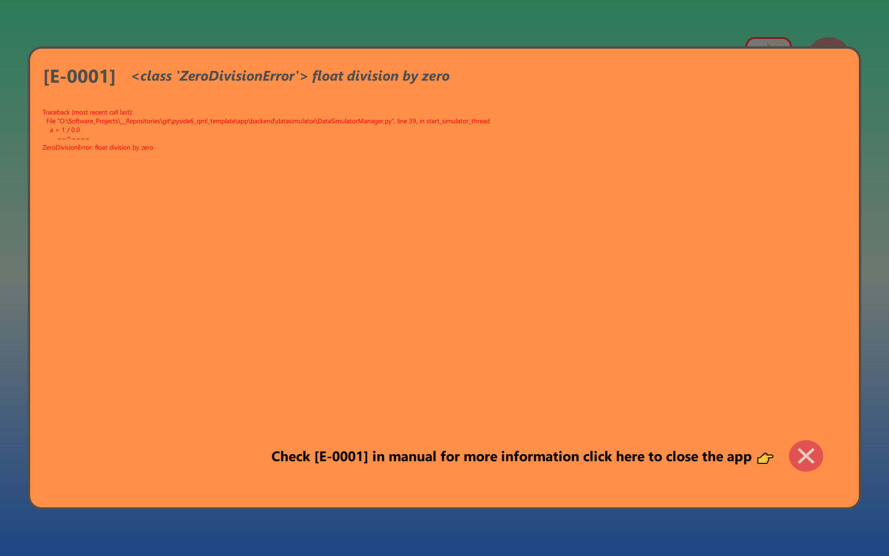

# Pyside6 qml template

This template creates an empty qml template with one subpage. 

> The app will currently only work on Windows 10. 

The following features have been enabled:
- hot reloading of qml
  - set `ENABLE_HOTRELOAD=1` in `start.app.bat`
- automatic conversion of resources.qrc to python resources_rc.py 
  - set `CONVERT_QRC=1` in `start.app.bat`
- integration with QmlElement (see `app/backend` and `app/frontend`)
- clickable images
- generation of error popup when error is raised in `app/backend`
- (threaded) logging of app and display screendump in `app/log`
- generation of venv by using `setup.venv.bat`
  - assumed Python312 has been installed in either standard location or manual set in `BASE_DIR_PYTHON`

## working of the template app 

The app will start with in a start-screen:

<br/>

When the standy-button is clicked the following function in `app\backend\DataSimulatorManager.py` will be executed:

```
    @Slot()
    def start_simulator(self):
        def start_simulator_thread():

            try:
                logger.info("Starting simulator thread")
                a = 1 / 0.0
                logger.info(f"{a=}")
            except ZeroDivisionError as e:
                self.displayError.emit(
                    ERROR_COULD_NOT_START_SIMULATOR, e, traceback.format_exc()
                )

        t = threading.Thread(target=start_simulator_thread)
        t.start()
```

Since the code will definitely raise the `ZeroDivisionError` the following popuscreen will be visible:

<br/>

